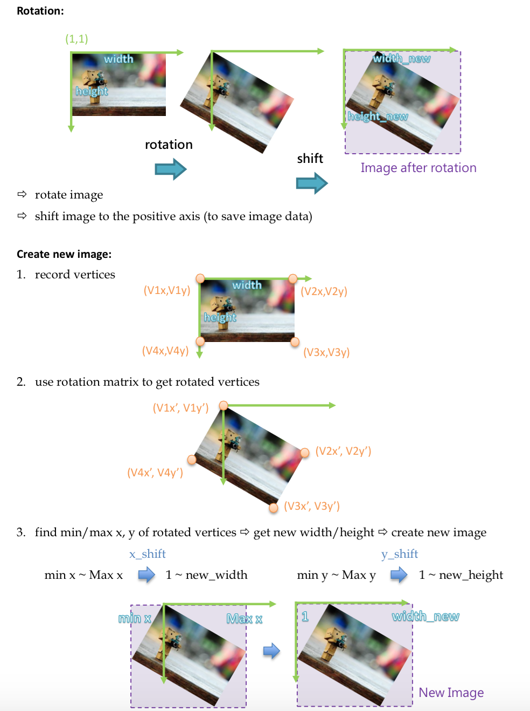
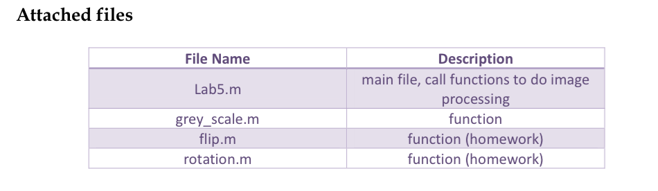

# HW0: Pixel array manipulation
## Brief
* Required files: results/index.md, and code/

# Objective
* Image file input/output.
* Pixel array manipulation, ex: image flip, rotation, grey scale.

# Prerequisite
* Matlab

# Pre-labs
* Read image and show it on the screen、save as a new image.
* Using grey_scale() function to obtain intensity image.

# Tutorials
```
<< Image Array of Matlab >>

Each image include 3 channel: R,G,B. Size of each channel is height x width.
I = imread(filename);       => [rrr...; ggg...; bbb...] 3 dimension matrix
R = I(:,:,1);               => [rrr...] 2 dimension matrix
G = I(:,:,2);               => [ggg...]
B = I(:,:,3);               => [bbb...]
r = R(h,w);                 => r 1 pixel 
g = G(h,w);                 => g
b = B(h,w);                 => b

******** Tips ********
1.	R = I(1:height, 1:width, 1);  => 1:height = 1~height
2.	R = I(:, :, 1);                 =>” : “ = all = 1~height
3.	" a=3 " vs " a=3; "            =>without " ; " to show the result on commend window
4.	" ctrl+Enter " to run code between ” %% “
5.	" ctrl+c " to stop “ run ”
6.	using " Breakpoints " to help you debug

```

<center>

<br>

<br>

<br>

<br>
(Left: originla image. Right: image overlap with corners.)
</center>


## Credits
	Assignment modified by Min Sun based on Prof. Huang's lab0 in 2014 


