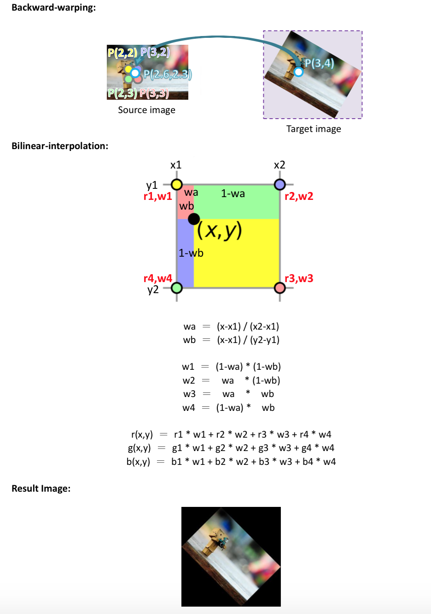
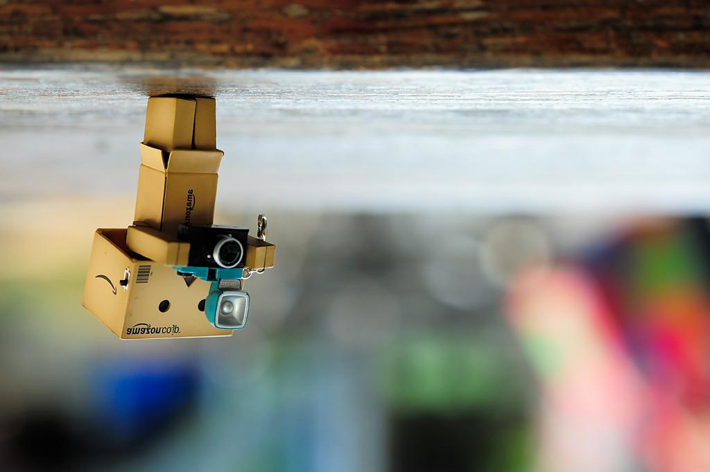

# 張植鈞 <span style="color:red">(student ID: 102061214)</span>

# HW0: Pixel array manipulation

## Overview
The goal of this assignment is to learn the basic image prosessing techniques of Matlab. First, we need to know what is an image for Matlab(pixel array), how Matlab store images and so on. With these fundamental knowledge, we can start "process" images. In this assignment, we tried to flip images and rotate images by ourselves.

## Implementation
1. Image Flipping(flip.m)     
	To flip an image, that is, to change the arrangement of the pixels in the image. For example, flipping an image horizontally is to exchange the last pixel to the first one on x direction, and sequentially repeat the step. However, the y direction pixels are still in the same order. Thus, we can get the flipping image by changing the pixel order. 
	* 1. horizontal flipping
	
	```
	I_flip = I(:,end:-1:1,:); 
	```
	
	* 2. vertical flipping
	
	```
	I_flip = I(end:-1:1,:,:);
	```

	* 3. horizontal + vertical flipping
	
	```
	I_flip = I(end:-1:1,end:-1:1,:);
	```
	The codes above is to change the pixel arrangement of the input image and assign to a new image array.

2. Image Rotation(rotation.m)
Steps:
	* 1. Use Rotation Matrix to Get New Vertices: 
	
	Rotation may cause the result image become an inclined rectangle, but we can only store the image in an array. Thus, we have to use the rotation image to get the new vertex so as to calculate the new width and height of the new image.
	
	* 2. Calculate New Width and Height: 
	
	After getting the new vertices, we can calculate the new width and height of the new image, and then initialize the array of the new image.

	* 3. Back-Warping Using Bilinear Interpolation:
	
	The last step is to shift and rotate the new pixel back, which is the most important part in image rotation. By doing so, we can know if the pixel is from the origin image not the padding pixels. However, the new image has been resized and different from the origin image, so we need to use bilinear interpolation approach to estimate the pixel in origin one.	
	
	
	
	Just read the codes for more details.

## Installation
* How to compile from source?

Run Lab5.m in Matlab

Usage: output = flip(image, type)

Usage: output = rotation(image, degree)

### Results

<table border=1>
<tr>
<td>


</td>
</tr>

<tr>
<td>


</td>
</tr>

<tr>
<td>


</td>
</tr>

</table>
